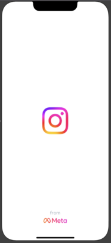
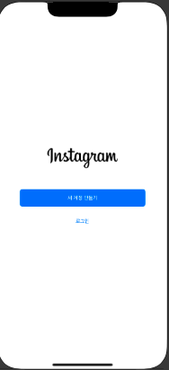
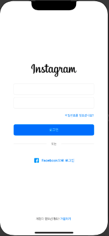
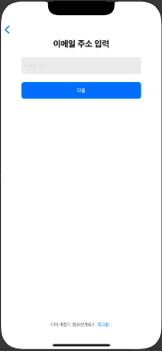
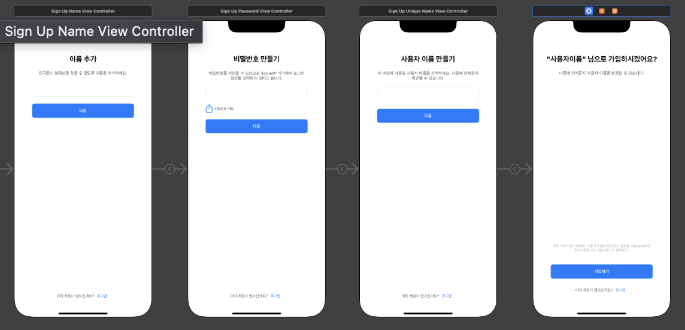

# 인스타그램 클론코딩(iOS-덕덕)
> 2022-10-29 
>   * 기획서 제출 - 100%
>   * 프로젝트 생성 및 깃허브 연동 - 100%
>   * Alamofire 설치 - 100%

> 2022-10-30 
>   * 스플래쉬 화면 구성 및 시간 조절 - 100%
>   * 로그인/회원가입 화면UI - 100%
>   * 뼈대 레이아웃 구성 - 15% (로그인-회원가입 간 navigation, segue구성)
>   
>       

> 2022-10-31
>   * 회원가입 화면 UI 수정 - 100%
>   * 회원가입 기능 구현 - 50% 
>     * 입력 오류 검사는 기능 완성 후 다룰 것!
>   * 팀 회의 
>     * 진행 상황 공유 
>     * 이미지 준비 분담
>     * API 명세서에 대한 회의 
>     * 어려운 점 및 질문 공유
>   * 개발 도중 이슈
>     * 홈 화면 UI에 대한 고민 -> 질문방에 질문
>     * 같은 방향의 스크롤 뷰를 피할 것(키워드 "nested scrollview"
>   

> 2022-11-1
>   * 로그인 기능 구현(API연동) - 100%
>   * 회원가입 기능 구현(API연동) - 70%
>   * 개발팀장님 피드백
>     * 메인 기능을 우선사항으로 구현한 다음, 상세한 UI 다루기
>       * 메인기능 - 게시글 작성, 게시글 조회, 마이 프로필 조회, 좋아요/(댓글) 기능
>     * Command LinkStoryboards failed with a nonzero exit code 에러 해결 -> 스토리보드 참조 수정
>     * 입력 오류 검사는 "정규표현식"
>     * 사용자 정보 유지(토큰)은 "userDefaults" 사용

> 2022-11-2
>   - 로그인 기능 수정(API) 
>   - 회원가입 기능 구현(API연동) - 100%

> 2022-11-3
>   - 페이스북 로그인 API 연동 - 90%
>     - 페이스북 로그인 오류 발견 

> 2022-11-4
>   - 페이스북 로그인 API - 100%
>     - 오류 -> AppDelegate에 코드 추가하여 해결
>   - 회원가입이 정상적으로 되지 않는 이슈 발견
>   - 컬렉션뷰 커스텀에 대한 고민

> 2022-11-5
>   - 회원가입 정상적으로 되지 않는 이슈 해결 -> 변수 초기화를 잘못했었음
>   - 팀 회의
>     - 진행상황과 어려운 점 공유
>     - 컬렉션뷰 커스텀과 라이브러리들(sheetPresentationController, YPImagePicker) 지식 공유 받음 
>   - 홈화면 - 30%(스토리 조회API연동)
>   - 프로필 화면 - 40%(자신의 프로필 조회API연동)
>     - 프로필 사진이 제대로 불러와지지 않는 이슈 

> 2022-11-6
>   - 프로필 화면 - 50%(자신의 프로필 조회 API연동)
>     - 프로필 사진 불러오기 해결
>   - 프로필 화면 중 게시물 나오는 피드부분 구현중
>     - 셀안에 Tabman 적용시키는 것 실패 
